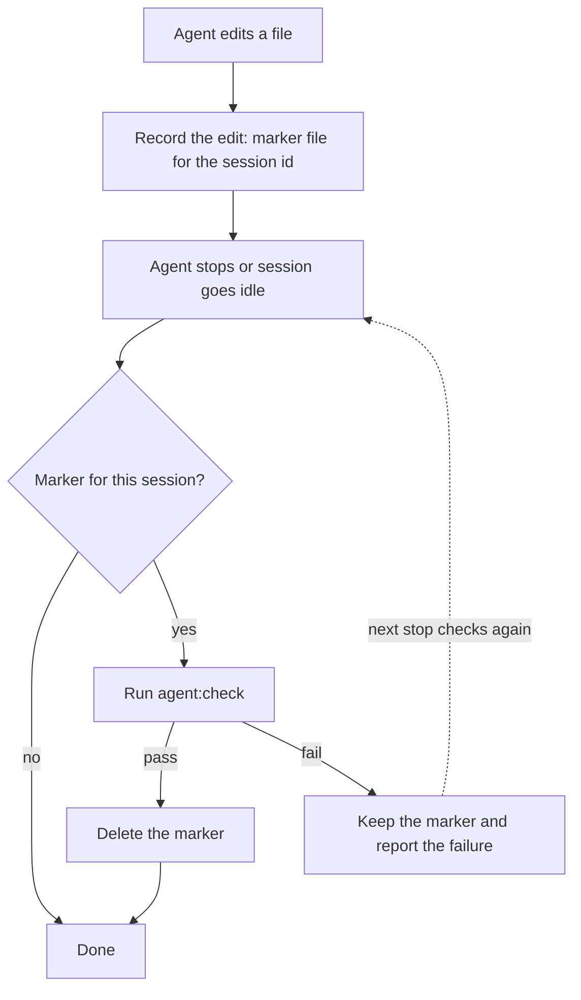

# Agent setup

The `.agents` folder holds the skills and hooks that coding agents use in this repository. Claude Code, Codex and OpenCode share one source here, so you write a skill or a check once and each agent gets it through a thin pointer or config.

## Skills

The skill body lives in `.agents/skills/<name>/SKILL.md`. Codex and OpenCode read it from there. Claude Code does not, so `.claude/commands/<name>.md` holds a pointer that tells it to read the skill file. OpenCode also gets a pointer in `.opencode/commands/<name>.md`, which gives the `/name` slash command.

To add a skill, write `SKILL.md` with `name` and `description` in the front matter. Then copy an existing pointer in both `commands` folders and change the name and description.

## Change check

When the agent stops, the hooks run `npm run agent:check` from `src`. This script applies the ESLint and Prettier fixes, then runs `build:ts`. The check runs only if the agent edited files in the current session. The hooks do not use `git diff` for this, because you can have your own uncommitted changes that the agent did not make.



The marker is an empty file at `src/node_modules/.cache/emmett-agent-check/<session_id>`. On failure, Claude Code and Codex get exit code 2 with the check output, which blocks the stop and gives the output back to the agent. OpenCode shows an error toast and writes the output to the OpenCode log.

| Agent       | On edit                                                                       | On stop                                   | Where configured                       |
| ----------- | ----------------------------------------------------------------------------- | ----------------------------------------- | -------------------------------------- |
| Claude Code | `PostToolUse` on `Edit\|Write\|MultiEdit\|NotebookEdit` runs `record-edit.ts` | `Stop` runs `validate-change.ts`          | `.claude/settings.json`                |
| Codex       | `PostToolUse` on `apply_patch\|Edit\|Write` runs `record-edit.ts`             | `Stop` runs `validate-change.ts`          | `.codex/hooks.json`                    |
| OpenCode    | `tool.execute.after` on `edit`, `write`, `apply_patch`                        | `session.status` event with `idle` status | `.opencode/plugins/validate-change.ts` |

OpenCode loads the plugin from `.opencode/plugins/`. The plugin keeps the edited session ids in memory, so it does not write marker files.

Edge cases:

- If `stop_hook_active` is set, the stop hook skips the check. This prevents a loop when the agent continues after a blocked stop.
- If the session id is missing or has characters other than letters, digits, `-` and `_`, the stop hook runs the check every time. This is the safe default.
- The hooks find the repository root with `git rev-parse --show-toplevel`, so the marker and the check use the root also when the agent works in a subdirectory.
- The OpenCode plugin runs the check asynchronously, so it does not block OpenCode. Only one check runs at a time.

The hook files export `recordEdit`, `validateChangedSession` and `validateChange`, so the code can move into a library later.

## Tests

Run the tests for the hooks and the plugin from `src`:

```shell
npx vitest run --project agents
```

Unit specs test the small functions without I/O. Integration specs run the hooks and the plugin against a temporary Git repository with a fake `agent:check` script.
