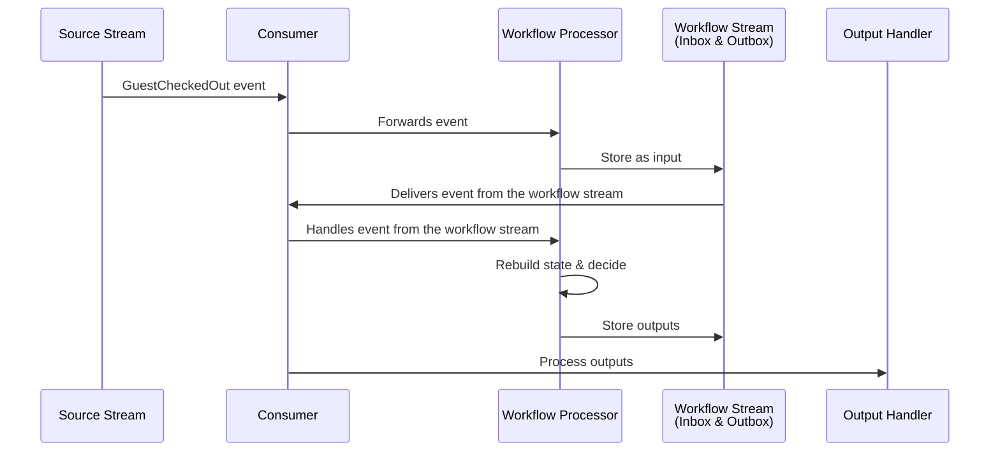
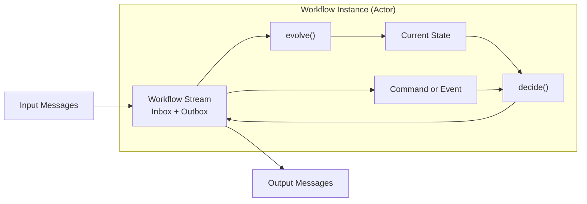

# RFC: Workflow Processing Engine for Emmett

**Status:** Pending

## Summary

We're adding a workflow processing engine to Emmett for coordinating multi-step/asynchronous business processes. It uses an event store behind the scenes to provide durable execution with full observability, treating each workflow instance as an event stream that acts as both inbox and outbox for handled messages.

## Problem

Multi-step processes are everywhere in business applications, not just the typical order-fulfilment examples:

- Hotel group checkout coordinating multiple room settlements,
- Code review workflow with multiple approvers and checks,
- Customer onboarding with verification steps,
- Incident response coordination across teams,
- Data ingestion with validation and enrichment stages.

### Why Durable Execution Matters

These processes need to survive more than we often realise. A group checkout may be a relatively quick batch operation, but a document review workflow can span days with human approvals. An incident response could run for hours, coordinating different teams.

When things fail, and they will, we need to know exactly where we stopped and why. A network blip shouldn't cause an in-progress checkout to be dropped in the middle. A service restart shouldn't forget which steps it passed. A bug fix shouldn't require manually tracking down stuck processes.

Of course, you could implement your own processing based on the existing abstractions in Emmett, like command handlers, consumers and async processors, but...

DIY solutions always have gaps. We handle the happy path, add some retry logic, then discover edge cases in production:

- Messages lost during deployment
- Processes stuck after partial failures  
- No way to resume after fixing bugs
- Can't answer "what happened to order X?"

### Current Tools Work But Bring Complexity

[Temporal](https://temporal.io/), [Restate](https://restate.dev/), [AWS Step Functions](https://aws.amazon.com/step-functions/), and similar tools solve these problems. They guarantee processes are complete despite failures. They provide visibility into process state. But they come with cognitive overhead.

To write a simple approval workflow in Temporal, you learn about activities, workflows, workers, task queues, and their deterministic replay requirements. Your "send email for approval" becomes an activity with retry policies, timeouts, and heartbeats. Testing requires their test server, time-skipping APIs, and mock activities.

These tools require learning their entire programming model, even for simple workflows. You get powerful features, but pay the complexity cost upfront, whether you need those features or not.

### What We Actually Need

We need durable execution that feels natural. Something that allows just writing regular code. Testing should be just calling functions. The patterns should match how we already think about our domain. Simple workflows should be simple to write, with complexity available when needed. Therefore, we need a model that reuses and repeats patterns, allowing for the learning ladder. This can be achieved by providing safe defaults and extension points for advanced scenarios. In other words, an accessible model enabling both newbies and advanced users.

## Background: Event Sourcing as Natural Solution

### What Makes Execution Durable

At its core, durable execution means three things:

1. Persist progress at each decision point
2. Resume from the last known state after failures
3. Know exactly what happened and why

Traditional approaches use state machines with database tables, workflow engines with proprietary storage, or complex checkpoint mechanisms. But there's a more straightforward way.

### Event Sourcing: Built-in Durability

Event sourcing stores every business decision as an immutable event. For workflows, this means every input received and output produced becomes an event in a stream. This isn't just storage - it's the recovery mechanism. We can expand this model and use the event store as the message store, storing all messages. This allows us to store both commands (intention to run business logic) and events (facts about what has happened, which can be used as triggers for next steps in the workflow).

Consider the following scenario:

1. Clerk initiating the group checkout for two guest stays, let's say with ids 1 and 2.
2. We need to record that the group checkout was initiated and start regular checkout processes for each guest stay.
3. Then we need to gather information based on successful or failed checkouts and complete the group checkout.

With our workflow design, the message stream with each recorded message representing a step in the workflow can look as follows:

1: InitiateGroupCheckout command handled.
2: GroupCheckoutInitiated event recorded for guest stays 1 and 2.
3: CheckOut command scheduled, initiating checkout for guest stay 1.
4: CheckOut command scheduled, initiating checkout for guest stay 2.

Then, the background process can poll those messages and sequentially process them, storing the checkpoints after successful processing.

Now, we could get the next step:

5: GuestCheckedOut event received informing about successful checkout for guest stay 1. 6. Process crashes and the second checkout was not processed.

That's not an issue, as upon restart, we can

1. Read the last successful checkpoint (which happens to be 3).
2. Continue processing triggering Checkout for guest stay 2.
3. No special recovery code needed

The workflow doesn't know it crashed. It just continues from where it left off.

### Why Event Sourcing Makes Workflows Simple

Beyond recovery, event sourcing brings natural benefits to workflows:

**Time Travel Debugging**: When a workflow fails, replay event-by-event to see the exact decision sequence. No more "I wonder what state it was in."

**What-If Analysis**: Fix a bug and replay to see if workflows would complete correctly. Test process changes against historical data.

**Natural Audit Trail**: Every decision is recorded with its trigger. Compliance and debugging come for free.

**Error Analysis**: We could also store errors as messages. See patterns across failed workflows. Understand systemic issues.

Emmett already provides these event sourcing primitives. We have event stores that handle both events and commands (message stores). We have the decide/evolve pattern for business logic. We have consumers for background processing. What's missing is the orchestration pattern to coordinate across multiple streams with proper correlation. That's what workflows add.

## Solution Overview

Workflows in Emmett follow the same mental model as [command handlers](https://event-driven-io.github.io/emmett/getting-started.html#command-handling): they receive commands, make decisions based on state, and produce new messages. But unlike command handlers that only respond to commands, workflows can react to events from anywhere in your system.

The pattern has three functions:

- `decide`: Business logic that takes input + state and returns outputs
- `evolve`: Builds state based on events (both inputs and outputs)  
- `initialState`: Starting state for new workflow instances

Each workflow instance gets its own event stream. This stream serves as both an inbox (recording inputs) and an outbox (recording outputs). This self-contained design means everything about a workflow instance lives in one place.

This design draws huge inspiration from [Yves Reynhout's Workflow Pattern](https://blog.bittacklr.be/the-workflow-pattern.html), adapting it to use Emmett's abstractions while aiming to retain its power.

Check also:

- [Pull Request with sample Emmett's Workflow based on this RFC](https://github.com/event-driven-io/emmett/pull/256),
- [My earlier article on implementing Workflow Pattern in TypeScript](https://event-driven.io/en/how_to_have_fun_with_typescript_and_workflow/),
- [My article on message bus and message handling that inspired some of this design](https://event-driven.io/en/inmemory_message_bus_in_typescript/)

## How it Works - Technical Design

### Processing Flow

When a message triggers a workflow, we use a double-hop pattern:

1. **Input message arrives** from source stream (event or command).
2. **Router function** (`getWorkflowId`) determines which workflow instance.
3. **Store input** in the workflow's stream (as inbox).
4. **Consumer delivers** the stored message from the workflow stream
5. **Rebuild state** by replaying all events through `evolve`.
6. **Call decide** with the input and current state.
7. **Store outputs** back in the workflow stream (as outbox).
8. **Output processor** sends commands and publishes events.

This flow ensures durability at each step:



### Code Example - Group Checkout

Let's see how this works with a group checkout workflow that coordinates multiple individual checkouts:

```typescript
export const GroupCheckoutWorkflow: Workflow
 GroupCheckoutInput,
 GroupCheckout,
 GroupCheckoutOutput
> = {
 decide,
 evolve,
 initialState,
};
```

The state tracks which guests have checked out:

```typescript
export type GroupCheckout =
  | { status: 'NotExisting' }
  | {
      status: 'Pending';
      guestStayAccountIds: Map<string, GuestStayStatus>;
    }
  | { status: 'Finished' };
```

The decide function contains our business logic:

```typescript
export const decide = (
  input: GroupCheckoutInput,
  state: GroupCheckout,
): WorkflowOutput<GroupCheckoutOutput> => {
  const { type } = input;

  switch (type) {
    case 'InitiateGroupCheckout': {
      return initiateGroupCheckout(input, state);
    }
    case 'GuestCheckedOut':
    case 'GuestCheckoutFailed': {
      return onCheckoutFinished(input, state);
    }
    case 'TimeoutGroupCheckout': {
      return timedOut(input, state);
    }
  }
};
```

and state evolution:

```typescript
export const evolve = (
  state: GroupCheckout,
  {
    type,
    data: event,
  }: WorkflowEvent<GroupCheckoutInput | GroupCheckoutOutput>,
): GroupCheckout => {
  switch (type) {
    case 'GroupCheckoutInitiated': {
      if (state.status !== 'NotExisting') return state;

      return {
        status: 'Pending',
        guestStayAccountIds: event.guestStayAccountIds.reduce(
          (map, id) => map.set(id, GuestStayStatus.Pending),
          new Map<string, GuestStayStatus>(),
        ),
      };
    }
    case 'GuestCheckedOut':
    case 'GuestCheckoutFailed': {
      if (state.status !== 'Pending') return state;

      return {
        ...state,
        guestStayAccountIds: state.guestStayAccountIds.set(
          event.guestStayAccountId,
          type === 'GuestCheckedOut'
            ? GuestStayStatus.Completed
            : GuestStayStatus.Failed,
        ),
      };
    }
    case 'GroupCheckoutCompleted':
    case 'GroupCheckoutFailed':
    case 'GroupCheckoutTimedOut': {
      if (state.status !== 'Pending') return state;
      return {
        status: 'Finished',
      };
    }
  }
};
```

We register it with routing and type information:

```typescript
export const groupCheckoutWorkflowProcessor = workflowProcessor({
  processorId: 'GroupCheckoutWorkflow',
  workflow: GroupCheckoutWorkflow,
  getWorkflowId: (input) => input.data.groupCheckoutId ?? null,
  inputs: {
    commands: ['InitiateGroupCheckout', 'TimeoutGroupCheckout'],
    events: ['GuestCheckedOut', 'GuestCheckoutFailed'],
  },
  outputs: {
    commands: ['CheckOut'],
    events: [
      'GroupCheckoutCompleted',
      'GroupCheckoutFailed',
      'GroupCheckoutTimedOut',
    ],
  },
});
```

Inputs and outputs has to be registered explicitly. We cannot detect them from types, as they're erased on the JavaScript runtime. Still, they will have a proper intellisense and get compiler help not allowing to register more types than allowed.

We're having an explicit registration for commands and events to make API explicit, and also not require additional wrapper functions in the `decide` method.

### Stream Structure

The workflow's stream name comes from the `getWorkflowId` function. Here's what the stream contains as the workflow executes:

```
Workflow Stream Contents:
Pos | Kind| Direction | Message
----|---------|-----------|------------------------------------------
1   | Command | Input     | InitiateGroupCheckout {groupId: '123'}
2   | Event   | Output    | GroupCheckoutInitiated
3   | Command | Output    | CheckOut {guestId: 'g1'}
4   | Command | Output    | CheckOut {guestId: 'g2'}
5   | Command | Output    | CheckOut {guestId: 'g3'}
6   | Event   | Input     | GuestCheckedOut {guestId: 'g1'}
7   | Event   | Input     | GuestCheckoutFailed {guestId: 'g2'}
8   | Event   | Input     | GuestCheckedOut {guestId: 'g3'}
9   | Event   | Output    | GroupCheckoutFailed
```

Notice how inputs and outputs interleave. The workflow receives inputs (positions 1, 6, 7, 8) and produces outputs (positions 2, 3, 4, 5, 9). Inputs can be either commands sent sequentially from the API, other message processing, or events recorded in regular streams.

Emmett's event store, which is actually a message store that tracks both events and commands with their types.

This single stream contains the complete story, including what triggered each decision and what the workflow ultimately decided. No distributed tracing needed.

## Why This Design

### Actor Model: Self-Contained Instances

Each workflow instance acts like an actor with its own mailbox:



This isolation brings several benefits:

- **No shared state**: Each workflow instance has its own stream
- **Horizontal scaling**: Process many workflows in parallel
- **Clear boundaries**: Easy to reason about each instance
- **Natural sharding**: Distribute by workflow ID

### Observable by Design

Everything about a workflow lives in one stream. Want to know why a checkout failed? Read the stream. Need to debug a stuck process? The entire history is there. This isn't observability bolted on - it's fundamental to how workflows work. When connected to OpenTelemetry, it should provide better visibility into business processes than regular solutions. Knowledge about abstractions like commands and events can provide durable context, not only for error debugging, but also for classical telemetry.

### Durable by Default

Recovery isn't a special case - it's just reading the stream and rebuilding state. No checkpointing logic. The same code path handles normal processing and crash recovery. If we want to replay messages, we can just replay processing from a specific stream position.

### Simple Testing

Workflows are pure functions. Testing them is straightforward:

```typescript
// Unit test
const state = { status: 'Pending', guestStayAccountIds: new Map(...) };
const input = { type: 'GuestCheckedOut', data: { guestId: 'g1' } };
const outputs = decide(input, state);
// Assert expected outputs
```

You can test it without workflow runtime using regular tests, or built-in Emmett Behaviour-Driven Design testing capabilities, e.g.:

```typescript
it('handles partial failures', () =>
  given([
    { type: 'GroupCheckoutInitiated', data: { guestIds: ['g1', 'g2'] } },
    { type: 'GuestCheckedOut', data: { guestId: 'g1' } },
  ])
    .when({
      type: 'GuestCheckoutFailed',
      data: { guestId: 'g2', reason: 'BalanceNotSettled' },
    })
    .then({
      type: 'GroupCheckoutFailed',
      data: { completedCheckouts: ['g1'], failedCheckouts: ['g2'] },
    }));
```

Read more in: [Unit testing docs](https://event-driven-io.github.io/emmett/getting-started.html#unit-testing).

A similar pattern can be used for a full integration test.

No special, external workflow runtime is needed to test the workflow code. Compare this to other tools where you need test servers, activity mocks, and time manipulation. Emmett workflows are just functions processing messages.

### Why Emmett Over Established Tools

**Familiar Patterns**: If you know Emmett's command handlers, you know workflows. Same decide/evolve pattern, just triggered by events too.

**Progressive Complexity**: Start with a simple workflow. Add timeout handling when needed. Add compensation if required. You don't front-load complexity.

**Lightweight Runtime**: No separate workflow server. No special deployment model. Just your application with background processors.

## Design Tradeoffs

### Latency: The Double-Hop Cost

Storing inputs before processing adds latency. A message goes:

1. Source → Workflow stream (store)
2. Workflow stream → Processor (execute)

For background processes, this extra hop is negligible compared to the business operations. For latency-sensitive operations, use regular command handlers instead.

Future versions could make this configurable, allowing for direct processing for low-latency needs and a double-hop approach for full observability. We'd need community feedback on whether this flexibility matters.

### Storage: Everything Twice

Messages exist in both source streams and workflow streams. A `GuestCheckedOut` event appears in:

- The guest's stream (source of truth)
- The workflow's stream (for processing)

This duplication is intentional. Different retention policies can help - keep workflow streams shorter since they're derived data. The observability benefit outweighs the storage cost for most applications.

### When Not to Use Workflows

Workflows aren't for everything:

- **Simple request-response**: Use command handlers.
- **Read models creation**: Use projections.
- **Simple message handling:** Use reactors, they're simple enough for basic choreography,
- **Synchronous operations**: Workflows can handle them, but for most cases, [command handlers](https://event-driven-io.github.io/emmett/getting-started.html#command-handling) are simpler.

Workflows shine for multi-step, long-running processes that coordinate across streams.

This design is based on Yves Reynhout's Workflow Pattern, which has proven itself in production systems. We've adapted it to fit naturally with Emmett's abstractions.

## Future Possibilities

### Other Workflow Patterns

The current design provides a simpler alternative to traditional process managers. We could add Saga as a stateless router with compensation logic and simple event handlers for choreography.

These would build on the similar foundation.

### Processing Mode Flexibility

Currently, we always store inputs first for full observability. Some workflows might prefer lower latency:

- **Full observability mode**: Current double-hop design
- **Direct mode**: Process immediately, only store outputs
- **Hybrid**: Configure per message type

This needs careful design to maintain durability guarantees.

### Enrichment Patterns

Workflows may sometimes need external data. How should they fetch it deterministically?

**Option 1 - Pre-enrichment**:
Enrich at system edges before the workflow sees the message.

**Option 2 - Enrichment Step**:
Dedicated enrichment workflows that add data.

**Option 3 - Request/Response**:

```
Workflow → FetchPrices query → Wait for Prices result.
```

The same can be used for external communication, and also for output enrichment/transformation.

Each has different tradeoffs for testing, performance, and complexity. We need user feedback.

### Messaging System Support

Today, inputs come from event stores. Tomorrow they could also come from:

- Kafka topics,
- RabbitMQ queues,
- SQS messages,
- Supabase queues,
- etc.

The workflow doesn't care about the source. Streams remain in the event store for durability.

### Error Handling Evolution

Future versions could:

- Store errors as events for analysis
- Configure retry policies per workflow
- Dead letter handling for poison messages
- Timeout escalation strategies

### Paid Tools (Making Emmett Sustainable)

I want to make Emmett sustainable through optional paid tooling:

**Visual Workflow Debugger**: Step through workflow execution with time travel. See state at each decision point. Understand complex flows visually.

**Business Process Analytics**: How long do checkouts take? Where do they fail? Which steps are bottlenecks? Dashboard for business users.

**State Diagram Generation**: Generate visual documentation from running workflows. See all possible paths. Spot missing transitions.

**Performance Analysis**: Which workflows consume most resources? Where are the hot paths? Optimisation recommendations.

**Documentation Generation**: Turn workflow definitions into readable docs. Keep business and code in sync.

**Question for the community**: Would these tools provide enough value to justify payment? This would fund continued Emmett development while keeping the core open source.

## Conclusion

This workflow engine brings durable execution to Emmett using patterns developers already know. It allows you to just write TypeScript code. Event sourcing provides durability and observability naturally, not as add-ons, but as fundamental properties.

We avoid the complexity of existing tools while keeping power available when needed. Simple workflows stay simple. Complex workflows become possible. Testing remains straightforward. We want to compose, avoiding vendor locking.

Together, we can build workflows that are both powerful and pleasant to use. We're really open to your questions, suggestions and constructive criticism.

We'd also like to know if the additional paid add-ons mentioned are something you would consider paying for.

Thank you in advance!
